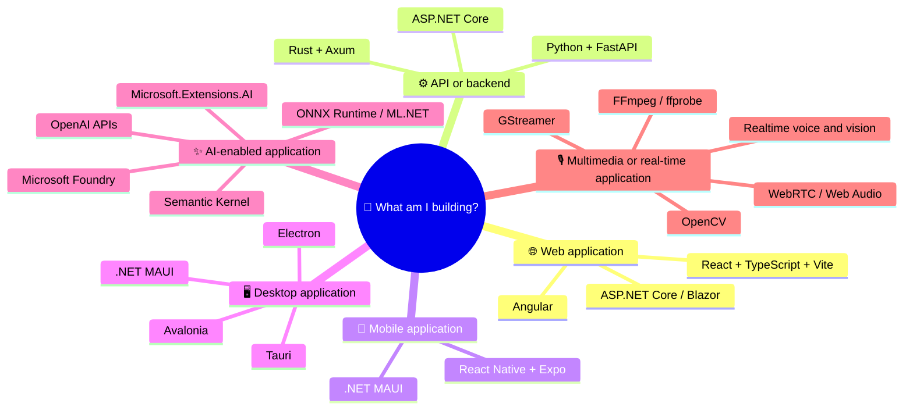

# MyLinks

An opinionated application-bootstrap handbook: the links, decisions, and repeatable recipes I want at hand when creating a modern application from zero.

> Last reviewed: 2026-07-15

## Start here

1. Choose the kind of application you are building.
2. Select one preferred route instead of evaluating every possible framework.
3. Install the required compilers and runtimes from the [language toolchain matrix](languages/README.md).
4. Complete the [new-project checklist](docs/start-here/new-project-checklist.md).
5. Follow the relevant stack guide and recipe.
6. Add project-specific architecture decisions to the new repository.

## Golden paths

<strong>Enterprise web application</strong>

- React + TypeScript + Vite
- Fluent UI 2
- Microsoft Entra + MSAL React
- ASP.NET Core
- Entity Framework Core + Azure SQL
- Blob Storage
- OpenTelemetry
- Playwright
- GitHub Actions
- Azure App Service or Azure Container Apps

Start with [React](docs/frontend/react.md), [.NET](docs/backend/dotnet.md), and [application foundations](docs/cross-cutting/application-foundations.md).

<strong>Rapid PoC or AI application</strong>

- React + TypeScript + Vite
- Python + FastAPI
- OpenAI APIs or Microsoft Foundry
- PostgreSQL or Azure SQL
- Docker
- pytest + Playwright

Start with [Python](docs/backend/python.md) and [modern AI](docs/ai/modern-ai.md).

<strong>Cross-platform desktop application</strong>

- C# route: Avalonia or .NET MAUI
- Web + native route: React + Tauri + Rust
- Electron only when its ecosystem or Node.js runtime is a material advantage

See [mobile and desktop](docs/platforms/mobile-desktop.md) and [Rust](docs/backend/rust.md).

<strong>Mobile application</strong>

- React route: React Native + Expo
- C# route: .NET MAUI
- Use native platform code only for capabilities not exposed by the cross-platform framework

See [mobile and desktop](docs/platforms/mobile-desktop.md).

<strong>Multimedia, voice, or real-time application</strong>

- React or native client
- WebRTC and Web Audio for browser real-time experiences
- ASP.NET Core or FastAPI backend
- FFmpeg and ffprobe for transformation and inspection
- OpenCV for computer vision
- OpenAI Realtime or another streaming model API when AI is involved

See [multimedia and real time](docs/multimedia/multimedia.md).

## Language toolchains

- [Genkidama and PositionTape language index](languages/README.md)
- [Managed, scripting, and web languages](languages/managed-scripting-web.md)
- [Native and systems languages](languages/native-systems.md)
- [Scientific, functional, and educational languages](languages/scientific-functional.md)

The language matrix provides official Windows, macOS, and Linux installation entry points for the 29 language families represented across Genkidama and PositionTape, plus SQLite as a related validation tool.

## Stack guides

### Frontend and UI

- [React + TypeScript + Vite](docs/frontend/react.md)
- [Angular](docs/frontend/angular.md)
- [Bootstrap, Fluent UI 2, accessibility, and visual foundations](docs/frontend/ui-systems.md)

### Backend

- [.NET and ASP.NET Core](docs/backend/dotnet.md)
- [Python and FastAPI](docs/backend/python.md)
- [Rust, Tokio, Axum, and Tauri](docs/backend/rust.md)

### Platforms and capabilities

- [Mobile and desktop](docs/platforms/mobile-desktop.md)
- [Modern AI](docs/ai/modern-ai.md)
- [Multimedia and real time](docs/multimedia/multimedia.md)
- [Identity, data, testing, security, observability, and DevOps](docs/cross-cutting/application-foundations.md)

## Initial recipes

- [React + Vite + Microsoft Entra SPA](recipes/react-vite-entra-spa.md)

Recipes are short implementation paths for problems already solved once. They complement official documentation; they do not replace it.

## Service health

- [AWS Health Dashboard](https://health.aws.amazon.com/health/status)
- [Microsoft Azure status](https://azure.status.microsoft/en-us/status/)
- [Google Cloud service health](https://status.cloud.google.com/)
- [GitHub status](https://www.githubstatus.com/)

## Learning and architecture

- [Microsoft Certified: Azure AI Engineer Associate](https://learn.microsoft.com/en-us/credentials/certifications/azure-ai-engineer/)
- [Azure Architecture Center](https://learn.microsoft.com/en-us/azure/architecture/)
- [.NET application architecture guides](https://learn.microsoft.com/en-us/dotnet/architecture/)
- [Mermaid documentation](https://mermaid.js.org/)

## Repository workflow

- `main` is the only long-lived branch.
- Use a short-lived branch for each change, such as `docs/add-link` or `chore/refresh-links`.
- Open a pull request before updating `main`.
- Delete the source branch after the pull request is merged.

## Maintenance rules

- Prefer official or primary sources over third-party tutorials.
- Prefer one recommended route and no more than two alternatives per problem.
- Explain when a technology should be used, not only what it does.
- Prefer HTTPS links and pages that are actively maintained.
- Replace outdated links instead of keeping duplicate legacy references.
- Mark technologies as `Recommended`, `Alternative`, `Reference`, or `Legacy` when the choice is not obvious.
- Let the automated link checker detect link rot on pull requests and on a monthly schedule.
